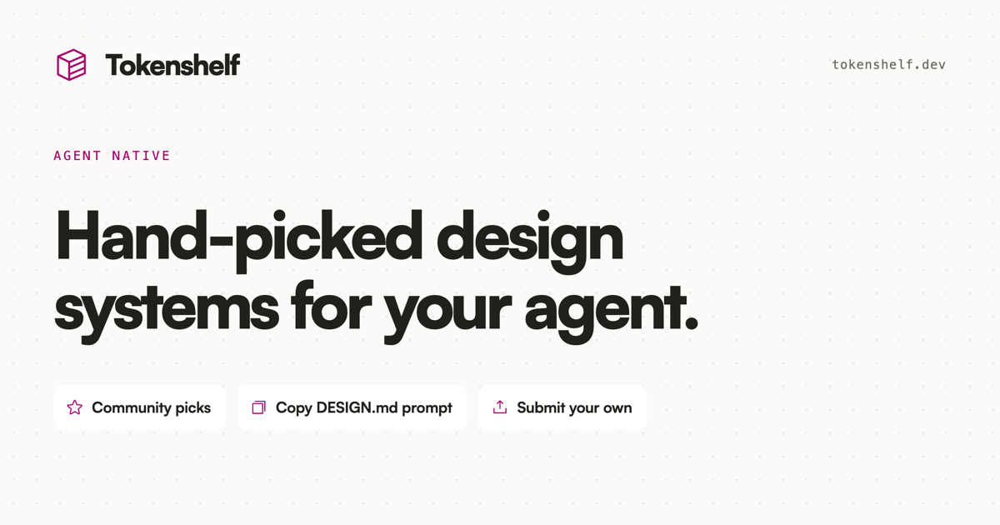

# Tokenshelf



[Tokenshelf](https://tokenshelf.dev) is a library of hand-picked design systems for coding agents. Browse community picks, copy a system's `DESIGN.md` prompt, or submit your own.

## Run locally

Requirements:

- Node.js 24.14.1 or newer
- Docker
- [Wasp 0.25](https://wasp.sh/docs/quick-start)
- A GitHub OAuth app with `http://localhost:3001/auth/github/callback` as a callback URL

Install the Wasp CLI:

```sh
npm install --global @wasp.sh/wasp-cli@0.25
```

Create `app/.env.server`:

```sh
GITHUB_CLIENT_ID=your-github-client-id
GITHUB_CLIENT_SECRET=your-github-client-secret
```

Apply the database migration and start the app:

```sh
cd app
wasp db migrate-dev
wasp start
```

Tokenshelf will be available at [http://localhost:3000](http://localhost:3000).

## Seed data

Seed the shared catalog systems plus local demo picks:

```sh
cd app
wasp db seed seedDevelopmentCatalog
```

Seed only the shared Tokenshelf-authored systems in production:

```sh
cd app
DATABASE_URL=your-production-database-url wasp db seed seedProductionCatalog
```
